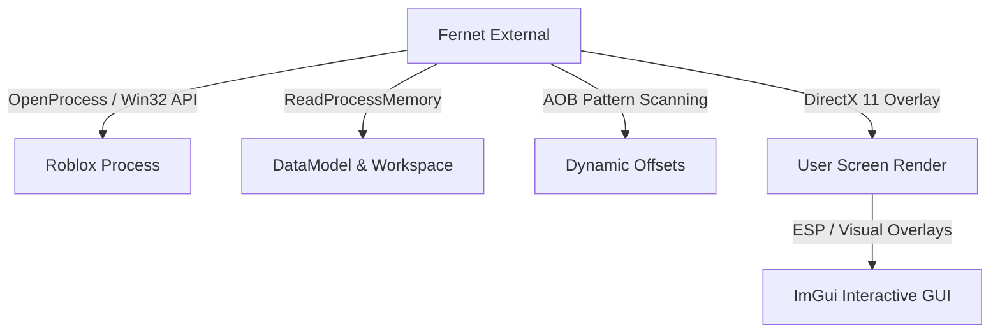
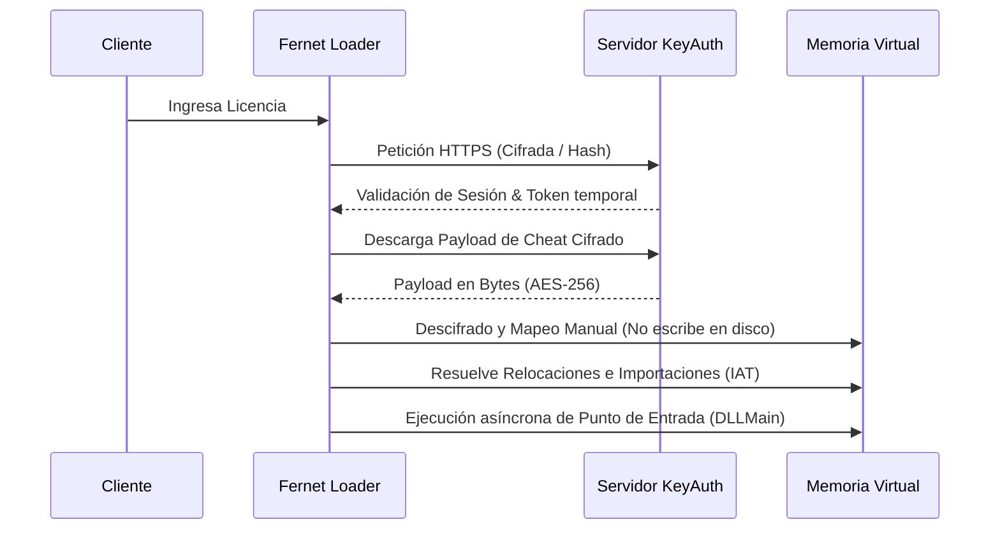

# ¡Hola! Soy Vinicius 👋

<p align="center">
  
</p>

### **🛠️ C++ Low-Level Developer | 🔍 Game Security & Reverse Engineer | 🛡️ Grey Hat Offensive Cybersecurity**
*Especializado en ingeniería inversa, desarrollo de loaders de seguridad en C++, extracción de offsets de memoria (dumping), exploits de videojuegos, cheats externos (destacando **Fernet Roblox** y **Fernet FiveM**), evasión de anticheats (VAC, EasyAntiCheat, BattlEye, Byfron/Hyperion) y desarrollo defensivo/ofensivo.*

---

<div align="left">
  <a href="https://github.com/invertilo">
    
  </a>
  
  
  
</div>

---

## 🧑‍💻 Presentación Profesional y Orígenes

Tengo 19 años y me especializo en el desarrollo de software a bajo nivel, la ingeniería inversa y la **ciberseguridad ofensiva bajo una filosofía de Sombrero Gris (Grey Hat)**. Mi pasión por la informática comenzó con la curiosidad de entender cómo los videojuegos procesan la física, la lógica de red y las variables críticas en memoria. Lo que empezó como la modificación de pequeños scripts en **Lua** escaló rápidamente hacia la deconstrucción de binarios complejos en **ensamblador (x86/x64)**, el análisis del espacio de usuario y kernel de Windows, y el desarrollo de sistemas distribuidos seguros.

Considero que la mejor forma de defender un sistema es entendiendo a la perfección cómo atacarlo y vulnerarlo de manera efectiva. En el ámbito del software de ventajas y la ciberseguridad, esto me permite diseñar soluciones defensivas altamente efectivas, ya que conozco de antemano las técnicas de evasión de memoria, inyección y spoofing que emplean los atacantes reales. Dedico mi día a día a la investigación de vulnerabilidades lógicas en motores de juegos comerciales (como *GTA V / FiveM* y *Roblox*), programando cargadores seguros (**Loaders**) y herramientas externas en **C++20** que implementan protección de integridad de código, inyección por mapeo manual y overlays interactivos fluidos optimizados mediante aceleración por hardware (**DirectX 11 / Dear ImGui**).

---

## ⚡ Enfoque de Seguridad Ofensiva (Grey Hat)

Mi labor operativa se desenvuelve bajo un esquema ético orientado a la investigación del comportamiento del software y a la ciberseguridad ofensiva. Mis pilares de enfoque son:

* **Investigación de Vulnerabilidades (Vulnerability Research):** Auditoría estática y dinámica de binarios protegidos y APIs web de juegos para encontrar desbordamientos de búfer, inyecciones de código, race conditions o debilidades lógicas en la comunicación cliente-servidor.
* **Simulación Ofensiva para Desarrollo Defensivo:** Recreación y desarrollo de exploits conceptuales (PoC) para documentar fallos de integridad y proporcionar firmas e indicadores de compromiso (IoCs) a desarrolladores de anticheats locales para que mitiguen estas brechas de seguridad.
* **Análisis de Evasión e Ingeniería Inversa:** Deconstrucción de packers comerciales (como VMProtect o Themida) y protectores a nivel de usuario para entender cómo interceptar y desofuscar de manera segura el flujo de instrucciones y llamadas nativas.

---

## 📂 Ecosistema de Proyectos y Desarrollos Técnicos en Detalle

A continuación se realiza un desglose técnico exhaustivo de los proyectos principales que he desarrollado, analizando sus características funcionales y su arquitectura de bajo nivel:

---

### 🎯 1. Fernet External (Roblox Memory Reader & Exploit)

**Fernet External** es una suite de asistencia de combate externa programada en **C++20**. La característica fundamental de este proyecto es su **arquitectura 100% externa**. No inyecta hilos dentro del espacio de memoria virtual de `RobloxPlayerBeta.exe` ni altera las tablas globales de Luau, reduciendo sustancialmente la firma de detección frente al sistema anti-cheat **Byfron (Hyperion)**.



#### 🏹 Módulo de Combate y Aimbot Avanzado
* **Algoritmo de Predicción de Latencia (Ping Prediction):**
  El módulo de apuntado intercepta y estima dinámicamente la latencia de red midiendo los tiempos de ida y vuelta. Utiliza esta estimación para calcular la posición futura del objetivo físico mediante la siguiente fórmula vectorial:
  $$\vec{P}_{predict} = \vec{P}_{actual} + (\vec{V}_{objetivo} \times t_{latencia})$$
  Donde $\vec{V}_{objetivo}$ es el vector `AssemblyLinearVelocity` extraído directamente de la estructura del objeto en la memoria del juego y $t_{latencia}$ es el retardo medido escalado según el ping.
* **Suavizado de Trayectoria Bilateral (Exponential Smoothing):**
  Divide los cálculos de interpolación angular para los ejes horizontal (Yaw) y vertical (Pitch) de manera independiente. Esto evita movimientos robóticos y permite una simulación de entrada de mouse orgánica utilizando curvas de aceleración logarítmicas:
  $$\theta_{nuevo} = \theta_{actual} + \frac{\theta_{deseado} - \theta_{actual}}{\text{Smoothing}}$$
* **Silent Aim (Aimbot Silencioso) con Hitchance:**
  Modificación externa de los vectores de disparo que redirige las trayectorias de balas directamente al objetivo visible más cercano sin alterar la vista física de la cámara local. Incluye un controlador de factor de aleatoriedad (*Hitchance*) de 0% a 100%.
* **Verificación de Colisiones (Raycast Wallcheck):**
  Lee la estructura jerárquica de partes físicas (`Workspace.Ignored` y estructuras del mapa) y realiza cálculos de intersección matemática de vectores tridimensionales para determinar si el objetivo está detrás de un obstáculo antes de fijar el disparo.
* **Cursor Personalizado e Interactivo:**
  Overlay que dibuja retículas dinámicas animadas (grosor, separación y rotación según el movimiento) que se adaptan a la dispersión de bala simulada.

#### 🌪️ Módulo de Rage & Desincronización (Desync)
* **Desync Pulse / Fake Lag:**
  Manipulación controlada del hilo de red local que descarta selectivamente el envío de paquetes de actualización de posición física al servidor durante intervalos programables en milisegundos. Genera el efecto de teletransportación y desfase visual.
* **Anti-Aim (Yaw Spinbot):**
  Modificación externa y constante de los valores de rotación física del personaje local en memoria, enviando al servidor posiciones rotatorias falsas para desviar el apuntado de aimbots automáticos enemigos.
* **Hitbox Expander con CanQuery:**
  Mapeo de la memoria del motor físico para expandir el tamaño del volumen de las partes de colisión del enemigo (Head, HumanoidRootPart, Torso). Se realiza parches de memoria para cambiar las dimensiones cliente-side de los objetos en studs, preservando la propiedad `CanQuery` activa para que las comprobaciones de proyectil sigan impactando la geometría ampliada.

#### 🎨 ESP y Visualizadores de Escena (Render Engine)
* **ESP Multivariable de Entidades:** Dibuja cajas tridimensionales delimitadoras basadas en el vector de escala de cada personaje, mostrando vida dinámica, nombre, ID de jugador y distancia.
* **Bullet Tracers & Movement Trails:** Dibuja líneas tridimensionales que conectan el cañón del arma del oponente con el punto final del proyectil, y genera estelas que marcan la ruta de movimiento previa de los objetivos.
* **Ambient Customizer & Skybox Changer:** Modificación de las propiedades de renderizado nativas del motor en memoria. Permite la eliminación total de niebla (`fog_remove`), la configuración de la distancia e intensidad del fog y la sobreescritura del skybox para aplicar un fondo negro/estrellado estético.

*Repositorio del Proyecto:*
➡️ **[Fernet External - Roblox](https://github.com/invertilo/fernet-roblox)**

---

### 🎮 2. Fernet FiveM (FiveM External Assisted Client)

**Fernet FiveM** (anteriormente conocido como *Rocket*) es un software externo de alto rendimiento especializado en la interacción de memoria con el motor de juego modificado de GTA V (FiveM). Su arquitectura se fundamenta en un motor de lectura asíncrona optimizado que recopila y proyecta información en un overlay invisible de alto rendimiento.

#### 🎯 Módulos de Combate y Asistencia
* **Legit Aimbot con Fijación Dinámica:** Fijación configurable por tecla rápida en cualquier hueso del modelo tridimensional del esqueleto del juego (cabeza, cuello, pecho, pelvis). Cuenta con un sistema de compensación de retroceso para contrarrestar la vibración del arma local.
* **Silent Aim & Magic Bullet:** Redirección asíncrona de los vectores de impacto directo al detectar que la munición es disparada por el jugador local. Magic Bullet calcula la posición de la entidad objetivo más cercana y reposiciona virtualmente el origen del proyectil en frente de la cámara, permitiendo disparos exitosos a través de paredes sólidas.
* **Triggerbot Inteligente:** Automatiza el disparo del arma actual al detectar que la retícula de apuntado pasa por encima de las coordenadas del modelo de colisión de un oponente válido. Incorpora retardos configurables en milisegundos para emular tiempos de respuesta humanos.

#### 👁️ ESP y Proyección de Coordenadas (World-to-Screen)
* **World-to-Screen Projection Engine:**
  Para renderizar información sobre la pantalla tridimensional del juego, el software lee de forma externa la matriz de vista de la cámara activa de FiveM y realiza cálculos matemáticos de proyección de coordenadas en 3D (espacio del juego) a coordenadas en 2D (píxeles de la pantalla):
  $$\begin{bmatrix} X_{pantalla} \\ Y_{pantalla} \end{bmatrix} = \text{Project}(\vec{P}_{entidad}, \mathbf{M}_{vista})$$
  Esta operación multiplica la posición 3D de la entidad por la matriz de proyección de la vista transpuesta y realiza la división de perspectiva en la coordenada homogénea $W$:
  $$X_{clip} = X \times M_{11} + Y \times M_{21} + Z \times M_{31} + M_{41}$$
  $$Y_{clip} = X \times M_{12} + Y \times M_{22} + Z \times M_{32} + M_{42}$$
  $$W_{clip} = X \times M_{14} + Y \times M_{24} + Z \times M_{34} + M_{44}$$
  Si $W_{clip} > 0.01$, las coordenadas en pantalla se normalizan:
  $$X_{pantalla} = \text{Ancho\_Pantalla} / 2 + (X_{clip} / W_{clip}) \times \text{Ancho\_Pantalla} / 2$$
  $$Y_{pantalla} = \text{Alto\_Pantalla} / 2 - (Y_{clip} / W_{clip}) \times \text{Alto\_Pantalla} / 2$$
* **ESP de Jugadores y Aliados:** Delineado mediante cajas completas 2D o de esquinas con colores HSL personalizados. Barras de salud y armadura con visualización dinámica por gradiente. ESP de armas equipadas mediante nombres de texto u optimización gráfica por iconos.
* **Tracker de Vehículos Activos:** Muestra el nombre de marca del vehículo cercano, distancia y estado de bloqueo (Locked/Unlocked) analizando externamente el bitmask de la puerta del coche en memoria.

#### 🚙 Modificaciones de Físicas de Vehículo
* **Handling Extractor & Patching:** Mapea la dirección de memoria de la clase handling del vehículo actual para modificar variables físicas en tiempo real. Permite alterar la masa física, la fuerza de tracción lateral, el factor de fricción aerodinámica y la aceleración instantánea.
* **Rocket Boost & Parachute:** Simulación física de aceleración forzada sobre los vectores de velocidad lineal del vehículo y despliegue del elemento paracaídas nativo.

#### 🔫 Parches de Armas y Movimiento
* **No Recoil & No Spread:** Localiza la estructura del arma equipada en la memoria virtual y pone a cero los multiplicadores flotantes correspondientes a la fuerza de retroceso horizontal/vertical y la dispersión angular de las balas.
* **Noclip Tridimensional:** Bypass de colisión que suspende la actualización física tradicional del personaje y permite el desplazamiento libre mediante teclas de dirección en coordenadas globales $(X, Y, Z)$ a través de cualquier superficie física.

*Repositorio del Proyecto:*
➡️ **[Fernet FiveM External](https://github.com/invertilo/fernet-fivem)**

---

### 📦 3. Fernet Loader (C++ GUI Client & Shell de Seguridad)

La puerta de entrada a todas las herramientas de la tienda Fernet. Desarrollada en **C++20**, es una interfaz gráfica de alto nivel que protege el software de ser manipulado y asegura la autenticidad de los clientes.



#### 🛠️ Proceso Detallado de Mapeo Manual (Manual Map Injection)
El inyector del loader no utiliza la API convencional `CreateRemoteThread` + `LoadLibrary` (que es altamente monitorizada por cualquier sistema de seguridad). En su lugar, recrea a nivel de software el cargador PE (Portable Executable) nativo del sistema operativo Windows:
1. **Reserva de Memoria Virtual:** Utiliza `VirtualAllocEx` para reservar un bloque continuo de memoria en el espacio de direcciones virtuales del proceso de juego destino, con permisos de lectura, escritura y ejecución (`PAGE_EXECUTE_READWRITE`). El tamaño solicitado corresponde al `SizeOfImage` definido en la cabecera opcional del PE.
2. **Escritura de Cabeceras y Secciones:** Copia las cabeceras del PE (Headers) y cada una de las secciones individuales (`.text`, `.data`, `.rdata`, `.reloc`) mapeándolas de acuerdo con sus direcciones virtuales relativas (RVA - Relative Virtual Addresses) en lugar de sus offsets de archivo.
3. **Procesamiento de Reubicaciones (Base Relocations):**
   Si la base de carga asignada por el sistema no coincide con la base de imagen preferida (`ImageBase`), se debe reubicar cada puntero absoluto en el código. El cargador recorre la tabla de reubicaciones (`IMAGE_DIRECTORY_ENTRY_BASERELOC`), parsea cada bloque y aplica la diferencia aritmética (delta) a los punteros absolutos correspondientes:
   $$\text{Delta} = \text{BaseActual} - \text{BasePreferida}$$
   $$\text{PunteroReubicado} = \text{PunteroOriginal} + \text{Delta}$$
4. **Resolución de Importaciones (IAT - Import Address Table):**
   Recorre la lista de descriptores de importación (`IMAGE_DIRECTORY_ENTRY_IMPORT`). Para cada biblioteca DLL requerida, carga el módulo en el proceso objetivo (si no está cargado) y localiza las direcciones de memoria de cada función importada mediante `GetProcAddress`. Luego, sobrescribe las direcciones en la tabla IAT con los valores de memoria reales resueltos.
5. **Ejecución de TLS Callbacks (Thread Local Storage):**
   Si el binario inyectado contiene callbacks de TLS (`IMAGE_DIRECTORY_ENTRY_TLS`), el loader localiza su tabla de direcciones y los ejecuta de forma secuencial antes de invocar el punto de entrada principal para asegurar que las variables locales del hilo se inicialicen correctamente.
6. **Invocación del Punto de Entrada (EntryPoint):**
   Finalmente, calcula la dirección del punto de entrada virtual (`AddressOfEntryPoint` + `BaseActual`) y arranca la ejecución del hilo principal del exploit mediante llamadas nativas indirectas.

* **Integración y Validación Remota (KeyAuth Session Sync):**
  Conexión segura SSL/TLS mediante **libcurl** para validar claves de acceso. Implementa un hilo monitor de sesión que verifica constantemente el estado del token de sesión generado por el servidor KeyAuth; si la sesión se invalida o expira, el Loader fuerza inmediatamente la finalización ordenada de todos los procesos activos relacionados.

---

### 🛡️ 4. Sistema de Autodefensa & Anti-Análisis (Anti-Cracking Suite)

Tanto los cheats externos como el cargador principal de Fernet incorporan una suite de autodefensa avanzada diseñada para combatir a ingenieros inversos, crackers y depuradores de sistemas:

* **Hilo Supervisor de Latidos (Heartbeat Monitor):**
  Un mecanismo asíncrono secundario (`HeartbeatMonitor`) que comprueba el contador de ciclos de un hilo paralelo (`HeartbeatThread`). Si un analista detiene la ejecución del programa mediante un punto de interrupción (Breakpoint) en herramientas como **x64dbg** o **IDA Pro**, el hilo supervisor detecta que el contador no se ha incrementado dentro del intervalo tolerado y finaliza inmediatamente el proceso (`exit(0)`), previniendo la inspección de memoria en pausa.
* **Detección de Hardware Breakpoints:**
  Monitorea constantemente el contexto de los registros de depuración del procesador Intel/AMD (`Dr0`, `Dr1`, `Dr2` y `Dr3`) mediante llamadas a `GetThreadContext`. Si se detecta un valor diferente de cero en estos registros (indicador de que un debugger ha establecido un breakpoint de hardware sobre una dirección de memoria), el software se autodestruye.
* **Lectura Directa de la Estructura PEB (Process Environment Block):**
  El software accede a la estructura interna PEB del hilo local mediante llamadas directas en ensamblador inline (accediendo al registro de segmento `GS` en arquitecturas de 64 bits o `FS` en 32 bits) para verificar los flags de depuración del sistema operativo sin llamar a las APIs tradicionales `IsDebuggerPresent`:
  ```cpp
  // Lectura directa en x64 del campo BeingDebugged en el PEB
  unsigned char* peb = (unsigned char*)__readgsqword(0x60);
  bool being_debugged = peb[2] != 0; // Offset 0x02 corresponde a BeingDebugged
  unsigned int* nt_global_flag = (unsigned int*)(peb + 0xBC); // Offset 0xBC (o 0x10C según la versión)
  if (being_debugged || (*nt_global_flag & 0x70)) {
      // 0x70 indica FLG_HEAP_ENABLE_TAIL_CHECK | FLG_HEAP_ENABLE_FREE_CHECK | FLG_HEAP_VALIDATE_PARAMETERS
      ExitProcess(0);
  }
  ```
* **Evasión de Depuradores a Nivel API (API Patching):**
  Parchea activamente funciones clave de la biblioteca de Windows `ntdll.dll` como `DbgBreakPoint` y `DbgUiRemoteBreakin` reemplazando sus bytes iniciales con instrucciones de retorno inmediato (`RET`) o terminación del sistema, neutralizando los intentos de inyección de debuggers que intentan acoplarse al proceso en tiempo de ejecución.
* **Mitigación y Restricción de Procesos (Process Mitigation Policies):**
  Invocación de `SetProcessMitigationPolicy` en tiempo de ejecución para obligar al sistema operativo a requerir firmas válidas de Microsoft en cualquier DLL cargada en el espacio de memoria, neutralizando herramientas de depuración genéricas.
* **Cifrado skCrypt:** Ofuscación estática de todas las cadenas de texto sensibles en tiempo de compilación.

---

## 🛠️ Tech Stack Extendido

### 🚀 Lenguajes de Programación y Scripting
* **C++20 / C:** Programación orientada al rendimiento a bajo nivel, manipulación de structs de memoria de Windows, llamadas directas al sistema (Syscalls) y optimización de overlays DirectX.
* **Lua:** Programación ofensiva y defensiva de scripts y anticheats personalizados para servidores FiveM.
* **TypeScript / JavaScript / Python:** Automatizaciones del lado del backend y scripts de soporte para emulación de API.

### ⚙️ Herramientas de Ingeniería Inversa y Desarrollo de Exploits
* **IDA Pro / Ghidra:** Desensamblado, descompilación y análisis estático de binarios PE protegidos e ingeniería inversa del código de Byfron/Hyperion.
* **x64dbg / Cheat Engine:** Depuración en tiempo real, análisis dinámico de memoria activa, tracing de instrucciones y reconstrucción de punteros dinámicos.
* **ReClass.NET:** Mapeo de estructuras de clases de memoria del motor de juegos en tiempo real para reconstruir vectores y entidades físicas.
* **Dear ImGui & DirectX 11 / 9:** Librería de UI ultra-rápida renderizada mediante pipelines gráficos acelerados por hardware.

### 🛡️ Ciberseguridad Ofensiva y Pentesting
* **Metasploit / Wireshark / Nmap:** Auditoría de red, análisis de protocolos de comunicación seguros del juego, descifrado de tramas de red y escaneo de puertos.
* **OWASP Top 10 API Security:** Estándar aplicado al desarrollo y auditoría de la API del Loader y del backend de control de licencias.

### 🎮 Entornos y Plataformas Específicas
* **Roblox & Byfron / Hyperion:** Plataforma objetivo para inyecciones externas y bypass de sistemas de protección basados en virtualización de instrucciones de usuario.
* **FiveM & GTA V Engine:** Entorno de ejecución de scripts en Lua y hacks externos basados en manipulación del módulo físico `FiveM_GTAProcess.exe`.
* **Docker & DevOps:** Contenedores y entornos aislados para el desarrollo y prueba de software de seguridad e infraestructura distribuida.

---

## 🎯 Objetivos de Investigación y Enfoques Actuales

* 🔍 **Desarrollo de Controladores Kernel (Drivers Ring 0):** Implementación de controladores firmados/mapeados dinámicamente para la lectura de memoria física saltando la protección de Handles estándar.
* 🛡️ **Análisis de Virtualización de Código:** Investigación de mecanismos avanzados de des-ofuscación para rutinas virtualizadas en VMProtect y Themida.
* 🧠 **Byfron Internals & Luau Decompilation:** Ampliar la investigación sobre el ofuscamiento del bytecode de Luau y las protecciones anti-tampering de Hyperion para mejorar las técnicas de evasión de Fernet External.
* 🐳 **Sistemas de Seguridad Distribuida:** Integración de sistemas de seguridad en loaders conectados a bases de datos relacionales robustas para mitigar el cracking por software.

---

## 📂 Proyectos Destacados

* **[Fernet External](https://github.com/invertilo/fernet-roblox):** Software de asistencia externa premium para Roblox. Lee y escribe la memoria del proceso del juego usando C++20 para ofrecer Aimbot, Visuales ESP, y modificaciones del mundo mediante un overlay fluido de Dear ImGui y DirectX 11, evadiendo las protecciones de Byfron/Hyperion.
* **[Fernet FiveM External](https://github.com/invertilo/fernet-fivem):** Mod menu y software de ventajas externo para FiveM con Aimbot, visuales ESP de vehículos y jugadores, noclip, modificaciones de armas y bypasses de seguridad indetectables.
* **[Fernet Loader](https://github.com/invertilo/fernet):** Gestor premium multijuegos desarrollado en C++ y Dear ImGui que permite inyectar y ejecutar menús de asistencia y cheats externos de forma controlada y segura, minimizando las firmas de detección e implementando evasión dinámica.
* **[askforvinicius](https://github.com/invertilo/askforvinicius):** Portfolio personal de seguridad premium para ejecutivos y líderes tecnológicos. Incluye un sistema integrado de simulación de intrusión (honeypot) para registrar e identificar intentos de explotación no autorizados.

---

## 📊 Estadísticas de GitHub

<p align="center">
  
  &nbsp;
  
</p>

---
*Diseñando soluciones seguras a bajo nivel e impulsando la ciberseguridad defensiva y ofensiva.*
